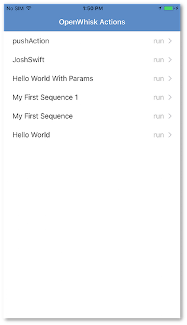
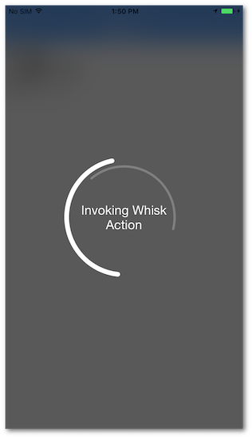
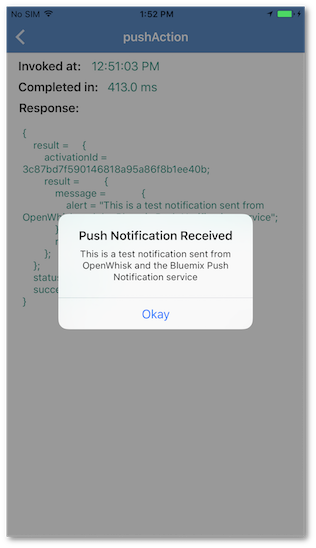
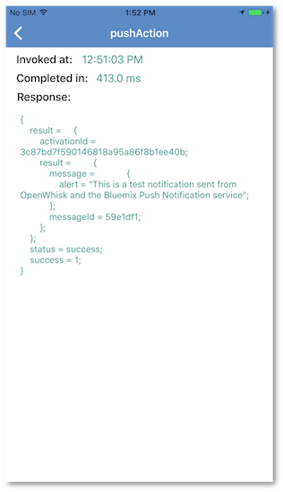

## OpenWhisk
Bluemix Mobile Starter for OpenWhisk in Swift

[](https://bluemix.net)
[](https://developer.apple.com/swift/)

### Table of Contents
* [Summary](#summary)
* [Requirements](#requirements)
* [Configuration](#configuration)
* [Run](#run)
* [License](#license)

### Summary

The Bluemix Mobile Starter for OpenWhisk will showcase how you can invoke OpenWhisk actions from a Mobile App.
It  contains a sample OpenWhisk action `actions/pushAction.js` that will trigger a push notification from OpenWhisk and notifiy the Mobile App that invoked it.

> **Note:** Do not name your project "openwhisk" as it will conflict with the dependency in Xcode.

### Requirements
* iOS 8.0+
* Xcode 8.0
* Swift 3.0

### Configuration
* [Bluemix OpenWhisk](https://new-console.ng.bluemix.net/openwhisk/cli)

#### Bluemix Mobile services and OpenWhisk Dependency Management
This starter uses the Bluemix Mobile services SDKs to use the functionality of the Mobile Analytics, Push Notifications, and OpenWhisk services.

The Bluemix Mobile services SDK uses [CocoaPods](https://cocoapods.org/) to manage and configure dependencies. To use our latest SDKs you need version 1.1.0.rc.2.

You can install CocoaPods using the following command:

```bash
$ sudo gem install cocoapods --pre
```

If the CocoaPods repository is not configured, run the following command:

```bash
$ pod setup
```

For this starter, a pre-configured `Podfile` has been included in the **ios_swift/Podfile** location. To download and install the required dependencies, run the following command in the **ios_swift** directory:

```bash
$ pod install
```
Now open the Xcode workspace: `{APP_Name}.xcworkspace`. From now on, open the `.xcworkspace` file because it contains all the dependencies and configurations.

If you run into any issues during the pod install, it is recommended to run a pod update by using the following commands:

```bash
$ pod update
$ pod install
```

> [View configuration](#configuration)

### Set up OpenWhisk.

For OpenWhisk setup, you need to get authentication from [Bluemix OpenWhisk](https://new-console.ng.bluemix.net/openwhisk/cli). Install OpenWhisk CLI and Auth.

Go into `OpenWhiskCredentials.plist` and set the `OpenWhiskAppKey` and `OpenWhiskAppSecret`. Get those credentials [here](https://console.ng.bluemix.net/openwhisk/learn/ios-sdk).

#### Create Whisk Action

A pre-created OpenWhisk JavaScript action has been provided in this starter, which will allow you to send push notifications. Your `pushAppSecret` has already been injected into the included pushAction. Use the following WSK CLI command to upload your action into OpenWhisk.

```
wsk action update pushAction actions/pushAction.js
```

### Run

1. Click **Product > Run** to start the app in Xcode.

2. Actions will be presented on the main screen that correspond to the actions in your OpenWhisk workspace.

3. Click an action from the list to run it. For example you can see our pushAction completed below:







### License
This package contains code licensed under the Apache License, Version 2.0 (the "License"). You may obtain a copy of the License at http://www.apache.org/licenses/LICENSE-2.0 and may also view the License in the LICENSE file within this package.
